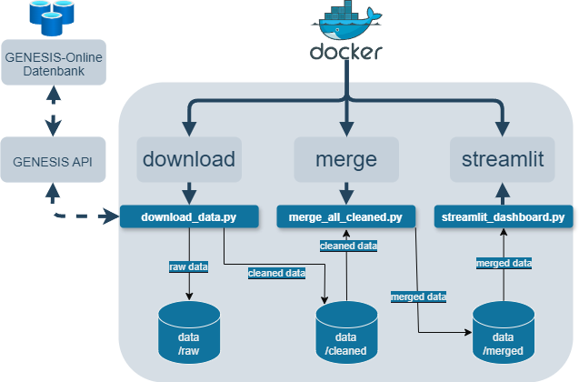

# 📈 GENESIS Datenanalyse Pipeline
___
Dieses Projekt automatisiert den **Download**, die **Verarbeitung** und **Analyse** von Daten aus der **GENESIS-Online Datenbank** des **Statistischen Bundesamts (Destatis)**.
___

## 🧭 Inhaltsverzeichnis

- [Projektübersicht](#-projektübersicht)
- [Tabellenstruktur](#-tabellenstruktur)
- [Ablaufdiagramm](#-ablaufdiagramm)
- [Setup & Installation](#-setup--installation)
- [Docker](#-docker)
- [Analyse startem](#-analyse-starten)
- [Fehlermeldungen](#-fehlermeldungen)

## 📁 Projektübersicht
```
.
├── images/                             # Diagramme und Visualisierungen
├── data/                               # Datenverzeichnis
│   ├── raw/                            # Rohdaten von GENESIS
│   ├── cleaned/                        # Bereinigte Daten
│   ├── merged/                         # Zusammengeführte Datensätze
│   └── cluster/                        # Cluster-Ergebnisse
├── src/                                # Quellcode
│   ├── download_table_auto.py          # API-Download
│   ├── loader.py                       # Datenladefunktionen
│   └── merge_cleaned.py                # Datenzusammenführung
├── download_data.py                    # Download-Skript
├── genesis_preprocessing.py            # GENESIS-Datenvorverarbeitung
├── merge_all_cleaned.py                # Zusammenführen aller bereinigten Datensätze
├── analyse.ipynb                       # Jupyter Notebook für die Analyse
├── cluster_analysis_extended.ipynb     # Jupyter Notebook für erweiterte Cluster-Analyse
├── docker-compose.yml                  # Multi-Container Setup
├── Dockerfile                          # Container-Konfiguration
├── requirements.txt                    # Python-Abhängigkeiten
└── streamlit_dashboard.py              # Analyse-Dashboard
```
___
## 🧾 Tabellenstruktur

- `0001`, `0002`: Personal & Umsatz  
- `0003`, `0004`: Einkaufs- & Investitionsdaten

🔗 **Kombinationen**:
- `0001` + `0003` → Personal & Einkauf  
- `0002` + `0004` → Umsatz & Investitionen
___
## 🗂 Ablaufdiagramm


---

## 🧪 Setup & Installation
Repository klonen
```bash
  git clone https://github.com/dein-nutzer/einfuehrung_data_science.git
  cd einfuehrung_data_science
```
Virtuelle Umgebung erstellen
```bash
    python -m venv .venv
```
   - Virtuelle Umgebung aktivieren
     ```bash
     # Windows CMD:
     .venv\Scripts\activate
     ```
    
     ```bash
     # macOS/Linux
     source .venv/bin/activate
     ```
Abhängigkeiten installieren     
```bash
  pip install -r requirements.txt
```
Erstelle eine `.env` Datei im Hauptverzeichnis
   ```env

   GENESIS_USERNAME=dein_benutzername
   GENESIS_PASSWORD=dein_passwort
   ```
___
## 🐳 Docker
Build & Run
```bash
  docker-compose up --build
```
Run
```bash
  docker-compose up
```
Stop
```bash
  docker-compose down
```
___
## 📊 Analyse starten
Streamlit Dashboard (lokal)
```bash
  streamlit run .\streamlit_dashboard.py
```
___
## ❓ Fehlermeldungen
| Häufige Probleme                     | Lösungen                          |
|--------------------------------|-------------------------------------------|
| ❌ `API-Zugriff fehlgeschlagen` | API-Login prüfen (`.env` korrekt?)        |
| ❌ `Fehlende Abhängigkeiten`  | pip install -r requirements.txt erneut ausführen |
| ❌ `Kodierungsprobleme bei CSV-Daten`     | Spaltennamen auf Konsistenz prüfen (Jahr, Kurzzeichen) |
| ❌ `Cluster-Visualisierung leer`     | Sicherstellen, dass numerische Spalten ausgewählt sind   |

